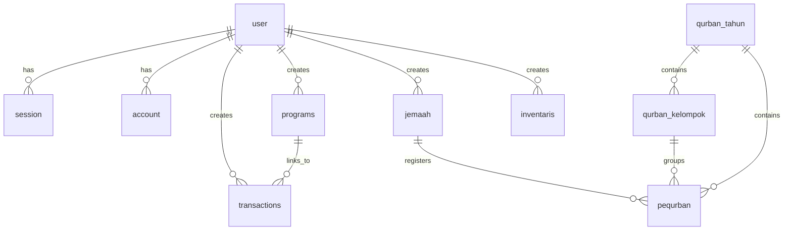

# Product Requirements Document (PRD)
# Sistem Informasi Manajemen & Portal Publik Masjid Al-Falah

---

## 1. Dokumen Kontrol & Ringkasan Eksekutif

- **Nama Produk:** Sistem Informasi Manajemen & Portal Publik Masjid Al-Falah (Dashboard Masjid Al-Falah)
- **Versi Dokumen:** 2.0 (Diperbarui sesuai implementasi rute dan fitur terkini)
- **Status Pengembangan:** Production-Ready / Active
- **Target Pengguna:** 
  1. **Pengurus DKM (Dewan Kemakmuran Masjid):** Ketua, Sekretaris, Bendahara, dan Pengurus Divisi.
  2. **Jemaah & Masyarakat Umum:** Warga sekitar, donatur (muzakki/shadaqah), pequrban, mustahik, dan pencari informasi jadwal/kajian.

### 1.1 Latar Belakang & Tujuan
Masjid Al-Falah memerlukan sistem terpadu yang memadukan dua fungsi krusial:
1. **Portal Publik Interaktif & Transparan:** Memfasilitasi jemaah untuk memantau jadwal sholat akurat, informasi kajian/berita, transparansi laporan kas secara terbuka, layanan pendaftaran jemaah, donasi online (QRIS/Transfer), pendaftaran qurban, dan saluran komunikasi langsung dengan DKM.
2. **Dashboard Manajemen DKM Terintegrasi:** Platform operasional terpusat dengan Role-Based Access Control (RBAC), pencatatan arus kas multi-kategori, sistem kanban program kerja dengan integrasi otomatis ke pembukuan keuangan, basis data jemaah berbasis peta spasial (GIS), manajemen qurban otomatis per kelompok sapi (maks. 7 orang), pengelolaan ZISWAF, inventaris, jadwal petugas ibadah, serta sistem audit log dan auto-backup berkala.

---

## 2. Arsitektur Sistem & Tech Stack

```
                                  ┌─────────────────────────────────────────┐
                                  │             CLIENT BROWSER              │
                                  ├────────────────────┬────────────────────┤
                                  │   Public Portal    │   DKM Dashboard    │
                                  │   (Vite + React)   │ (React + RBAC UI)  │
                                  └─────────▲──────────┴──────────▲─────────┘
                                            │ HTTP / REST         │ WebSocket (Socket.IO)
                                  ┌─────────▼─────────────────────▼─────────┐
                                  │        EXPRESS.JS BACKEND (Node)        │
                                  │   • Helmet Security & Rate Limiter      │
                                  │   • Anti-XSS Sanitizer Middleware       │
                                  │   • Better-Auth Session Verification    │
                                  │   • Socket.IO Realtime Event Emitter    │
                                  │   • Auto Backup & Cron Job Service      │
                                  └────────────────────▲────────────────────┘
                                                       │ Drizzle ORM
                                  ┌────────────────────▼────────────────────┐
                                  │          DATABASE (MySQL)               │
                                  │  Auth | Kas | Proker | Jemaah | Qurban  │
                                  │  ZISWAF | Inventaris | Jadwal | Berita  │
                                  └─────────────────────────────────────────┘
```

### 2.1 Frontend Stack
- **Framework:** React 18, Vite.
- **Routing:** React Router DOM v6 dengan Suspense & Route-level Code Splitting.
- **Styling & UI:** Modern Emerald Glassmorphism & Tailored Dark Mode, CSS Variables, Lucide React Icons.
- **Visualisasi Data & Grafik:** Chart.js, React-Chartjs-2.
- **Peta Interaktif (GIS):** Leaflet & React-Leaflet (OpenStreetMap Tile Layer).
- **Interaktivitas:** `@hello-pangea/dnd` (Drag-and-drop Kanban Board).
- **Ekspor Dokumen:** jsPDF, jsPDF-AutoTable, XLSX (SheetJS).
- **Komunikasi Data:** Axios / Native Fetch dengan Interceptors, Socket.IO Client.
- **Autentikasi Klien:** Better Auth Client SDK (`@better-auth/react`).

### 2.2 Backend Stack
- **Runtime:** Node.js, Express.js, TypeScript.
- **Database Engine:** MySQL (Support Local MySQL / Cloud DB seperti TiDB / Aiven).
- **Object Relational Mapping (ORM):** Drizzle ORM dengan Drizzle-Kit Migrations.
- **Autentikasi & Session:** Better Auth (Cookie-based session, Password Hashing, Verification Token).
- **Real-Time Engine:** Socket.IO Server (Event synchronization antar pengurus).
- **Keamanan:** Helmet (Cross-Origin Resource Policy disesuaikan), Express Rate Limiter, DOMPurify/Input Sanitizer.
- **Scheduled Services:** `node-cron` untuk backup otomatis database MySQL (`mysqldump`) harian pukul 02:00 WIB dan sinkronisasi status kegiatan.
- **Email Service:** Nodemailer (SMTP Gateway untuk verifikasi akun).

---

## 3. Pemetaan Rute Sistem (Information Architecture)

### 3.1 Rute Publik (Public & Jemaah Portal)
| Rute | Komponen Utama | Hak Akses | Deskripsi & Fitur Utama |
|---|---|---|---|
| `/` | `LandingPage.jsx` | Publik | Beranda utama: Hero Banner, Bar Jadwal Sholat Real-time + Countdown, Highlight Kas & Program, Peta Sebaran Jemaah & Mustahik, QRIS Donasi, Berita Terkini, Form Kontak & Pendaftaran Jemaah. |
| `/profil` | `ProfilPage.jsx` | Publik | Profil Masjid: Sejarah, Visi & Misi, Struktur Organisasi DKM, Fasilitas, Galeri, dan Lokasi Google Maps. |
| `/transparansi-keuangan` | `TransparansiKeuanganPage.jsx` | Publik | Laporan Kas Terbuka: Metrik Saldo Kas Terkini, Ringkasan Pemasukan & Pengeluaran, Grafik Pertumbuhan Kategori Dana, Akun Rekening Resmi. |
| `/berita-kegiatan` | `BeritaKegiatanPage.jsx` | Publik | Pusat Berita & Artikel: Pencarian artikel, filter kategori (Kajian, Sosial, Pembangunan, PHBI), Modal Baca Berita Detail dengan estimasi waktu baca. |
| `/portal-dkm` | `LoginPage.jsx` | Publik | **Gerbang Login Khusus Pengurus DKM** (URL disamarkan dari `/login` default untuk proteksi bot & brute-force). |
| `/verify-email` | `VerifyEmailPage.jsx` | Publik | Halaman konfirmasi verifikasi token email akun pengurus. |
| `/login` | Redirect | Publik | Otomatis dialihkan (`Redirect 302`) ke `/` (menutup akses langsung ke default path). |
| `/daftar`, `/pendaftaran` | Redirect | Publik | Otomatis dialihkan (`Redirect 302`) ke anchor pendaftaran jemaah di Landing Page (`/#daftar`). |

---

### 3.2 Rute Terproteksi DKM (Protected Dashboard)
*Seluruh rute di bawah ini dilindungi oleh `ProtectedRoute` dengan verifikasi session aktif Better Auth. Hanya dapat diakses setelah login via `/portal-dkm`.*

| Rute Dashboard | Komponen Halaman | Role Minimal | Deskripsi Fitur Utama |
|---|---|---|---|
| `/dashboard` | `Dashboard.jsx` | Pengurus | **Overview Eksekutif:** Ringkasan Kas Masjid, Total Jemaah, Proker Berjalan, Jadwal Sholat Hari Ini, Quick Action, Grafik Arus Kas Mingguan/Bulanan. |
| `/dashboard/keuangan` | `KeuanganPage.jsx` | Bendahara / Ketua | **Manajemen Arus Kas:** Pencatatan Pemasukan & Pengeluaran, Filter Kategori (Kas Umum, Infaq, Zakat, Operasional, Pembangunan), Filter Tanggal, Ekspor PDF & Excel. |
| `/dashboard/program-kerja` | `ProgramKerjaPage.jsx` | Sekretaris / Ketua | **Manajemen Program Kerja:** Tampilan List & Kanban Board Interaktif (Direncanakan, Berjalan, Selesai, Dibatalkan), Anggaran vs Realisasi, Modal Penyelesaian dengan **Auto-Sync ke Kas**. |
| `/dashboard/jemaah` | `JemaahPage.jsx` | Pengurus | **Database Jemaah & GIS:** Data profil jemaah, klasifikasi (Muzakki, Mustahik, Yatim, Lansia, Umum), Geotagging koordinat (Lat/Lng), Peta Interaktif Sebaran, Import & Export Excel. |
| `/dashboard/inventaris` | `InventarisPage.jsx` | Pengurus | **Aset & Perlengkapan Masjid:** Pendataan barang/fasilitas, jumlah, lokasi penyimpanan, kondisi (Baik, Rusak Ringan, Rusak Berat), tanggal perolehan. |
| `/dashboard/analisis` | `LaporanPage.jsx` | Pengurus / DKM | **Analisis & Pelaporan:** Grafik pertumbuhan keuangan bulanan/tahunan, tren donasi, demografi jemaah, cetak laporan pertanggungjawaban (LPJ) PDF. |
| `/dashboard/ziswaf` | `ZiswafPage.jsx` | Bendahara / Ketua | **Pengelolaan ZISWAF:** Pencatatan Zakat Fitrah, Zakat Mal, Infaq, Sedekah, Wakaf, data Muzakki/Donatur, cetak bukti penerimaan. |
| `/dashboard/qurban` | `QurbanPage.jsx` | Pengurus | **Manajemen Qurban Terpadu:** Pengelolaan Tahun Qurban, Pembentukan Kelompok Sapi (Maks 7 orang) & Kambing, Pelacakan Status Pembayaran (Proses/Lunas/Selesai), Grafik Tren Tahunan. |
| `/dashboard/jadwal` | `JadwalPage.jsx` | Sekretaris / Pengurus | **Jadwal Petugas Ibadah:** Penugasan Khotib Jumat, Imam Rawatib, Muadzin, Topik Khutbah/Kajian, dan nomor kontak petugas. |
| `/dashboard/berita` | `BeritaPage.jsx` | Sekretaris / Pengurus | **CMS Berita & Konten:** Pembuatan artikel/berita, upload foto dokumentasi, kategori artikel, status publikasi, integrasi ke halaman publik. |
| `/dashboard/pesan` | `PesanPage.jsx` | Pengurus / DKM | **Inbox Pesan Masuk:** Manajemen pesan pertanyaan/masukan jemaah dari landing page, status (Baru, Dibaca, Selesai), dan tombol **Direct Reply via WhatsApp**. |
| `/dashboard/notifikasi` | `NotificationPage.jsx` | Pengurus | **Pusat Notifikasi:** Riwayat pemberitahuan pesan baru, transaksi kas, pengingat jadwal, dan update program. |
| `/dashboard/settings` | `SettingsPage.jsx` | Ketua / Admin | **Pengaturan Sistem:** Tab Profil Masjid, Tab Kategori Kas & Bank, Tab Master Status Data, Tab Manajemen Pengguna & Hak Akses (RBAC), Tab Keamanan. |

---

## 4. Spesifikasi Fungsional Mendalam per Modul

### 4.1 Modul Autentikasi, Keamanan & RBAC (Role-Based Access Control)
1. **Pemisahan Jalur Masuk Pengurus:** Rute login diamankan pada endpoint `/portal-dkm` untuk memitigasi eksploitasi automated vulnerability scanning pada rute default `/login`.
2. **Hierarki Peran (RBAC):**
   - **Ketua (Super Admin):** Memiliki hak penuh membaca, membuat, mengubah, menghapus data di seluruh modul, mengelola akun pengurus, dan melihat audit logs.
   - **Bendahara:** Berfokus pada tata kelola finansial; memiliki izin penuh pada modul Keuangan, ZISWAF, Qurban, Laporan Kas, dan Pengaturan Rekening Bank.
   - **Sekretaris:** Berfokus pada administrasi; memiliki izin penuh pada Program Kerja, Database Jemaah, Jadwal Petugas, Berita/Artikel, Inventaris, dan Pesan Masuk.
   - **Pengurus:** Akses operasional harian untuk input data jemaah, inventaris, memantau kegiatan, dan melihat jadwal.
3. **Audit Log Otomatis:** Setiap operasi mutasi data penting (Create, Update, Delete) dicatat ke tabel `audit_log` beserta User ID, Nama, Role, Aksi, IP Address, dan User Agent.
4. **Keamanan Jaringan & API:**
   - Global Rate Limiter: Membatasi volume request untuk mencegah serangan DoS / Brute-force.
   - Sanitasi Input: Pembersihan tag berbahaya pada request body dan query untuk mencegah Stored XSS.
   - Helmet & CORS: Kebijakan cross-origin yang aman untuk akses multi-perangkat jaringan lokal DKM.

---

### 4.2 Modul Portal Publik & Keterlibatan Jemaah
1. **Landing Page Interaktif:**
   - **Hero Section:** Visi singkat masjid dan aksi cepat (Donasi & Info Jadwal).
   - **Bar Waktu Sholat Terintegrasi:** Menghitung waktu sholat harian (Subuh, Terbit, Dzuhur, Ashar, Maghrib, Isya) dengan indikator sholat berikutnya dan countdown waktu mundur real-time.
   - **Transparansi Mini & Statistik:** Ringkasan saldo kas umum dan jumlah kegiatan yang aktif secara transparan.
   - **Peta Interaktif Sebaran Jemaah:** Visualisasi spasial klaster jemaah, mustahik, dan donatur di sekitar lingkungan masjid menggunakan OpenStreetMap & Leaflet.
   - **Modal Donasi / Infaq Digital:** Menampilkan rekening resmi masjid (Bank Syariah Indonesia) dan QRIS interaktif lengkap dengan panduan transfer.
   - **Form Pendaftaran Jemaah Mandiri:** Memungkinkan warga mendaftar sebagai jemaah masjid secara langsung dari landing page.
   - **Form Kontak Publik:** Formulir bagi publik untuk menyampaikan pesan/pertanyaan yang langsung terhubung ke inbox dashboard DKM.
2. **Halaman Profil & Transparansi Keuangan Terbuka:**
   - Memberikan laporan akuntabilitas kas masjid kepada publik dengan grafik distribusi pemasukan vs pengeluaran.
3. **Portal Berita & Kegiatan:**
   - Akses berita, dokumentasi foto, dan artikel kajian dengan fitur pencarian instan dan kategori.

---

### 4.3 Modul Manajemen Keuangan & Arus Kas Transparan
1. **Pencatatan Arus Kas:**
   - Tipe transaksi: `Pemasukan` dan `Pengeluaran`.
   - Kategori dinamis: *Kas Umum, Dana Infak, Dana Zakat, Operasional, Pembangunan*, dan kategori kustom lainnya.
   - Relasi ke Program Kerja: Setiap transaksi dapat ditautkan ke program kerja terkait.
2. **Filter & Analisis Finansial:**
   - Penyaringan berdasarkan rentang tanggal, kategori, dan jenis transaksi.
   - Perhitungan otomatis Total Pemasukan, Total Pengeluaran, dan Saldo Akhir.
3. **Pelaporan & Ekspor Data:**
   - Ekspor laporan arus kas ke format **PDF resmi** (siap cetak untuk papan pengumuman/rapat DKM) dan **Excel (XLSX)** untuk pembukuan akuntansi lanjutan.

---

### 4.4 Modul Program Kerja & Kanban Board Interaktif
1. **Status Alur Kerja Program:**
   - `Direncanakan` (Planned)
   - `Sedang Berjalan` (In Progress)
   - `Selesai` (Completed)
   - `Dibatalkan` (Cancelled)
2. **Papan Kanban Drag & Drop:**
   - Memungkinkan pengurus memindahkan status program secara visual dan intuitif.
3. **Otomasi Finansial saat Penyelesaian Program (Auto-Financial Sync):**
   - Saat status program diubah menjadi `Selesai`, sistem memunculkan modal evaluasi dan form **Realisasi Anggaran**.
   - Sistem secara otomatis mencatat pengeluaran riil tersebut ke dalam Modul Keuangan (`transactions`) dengan kategori yang sesuai dan menautkan ID program.
4. **Dokumentasi & Laporan:**
   - Penyimpanan link/file dokumen LPJ dan link dokumentasi foto kegiatan.

---

### 4.5 Modul Database Jemaah & Pemetaan Spasial (GIS)
1. **Profil Terpadu Jemaah:**
   - Data identitas: Nama, Alamat, No. WhatsApp/Telepon, Email.
   - Klasifikasi Kategori Sosial: `Muzakki`, `Mustahik`, `Yatim`, `Lansia`, `Umum`.
   - Pencatatan Keahlian/Skills jemaah (bermanfaat untuk pemberdayaan program masjid).
2. **Geotagging & Integrasi Peta (GIS):**
   - Koordinat Latitude & Longitude jemaah disimpan untuk visualisasi klaster sebaran warga di Leaflet Map.
   - Membantu DKM dalam zonasi pembagian zakat/daging qurban dan pemetaan mustahik prioritas.
3. **Manajemen Data Massal:**
   - Ekspor seluruh basis data jemaah ke Excel.
   - Impor massal data warga dari file spreadsheet.

---

### 4.6 Modul Manajemen Qurban Terpadu
1. **Struktur Berjenjang (Hierarchical Qurban Management):**
   - **Tahun Qurban (`qurban_tahun`):** Manajemen tahun pelaksanaan qurban (misal: 1445 H / 2024 M, 1446 H / 2025 M).
   - **Kelompok Qurban (`qurban_kelompok`):** Pengelompokan shohibul qurban.
   - **Data Pequrban (`pequrban`):** Data individu pequrban yang terhubung ke database `jemaah`.
2. **Aturan Bisnis & Validasi Kelompok Sapi (Maksimal 7 Orang):**
   - Sesuai syariat fiqih, 1 ekor sapi maksimal untuk 7 orang pequrban.
   - Sistem melakukan **validasi ganda (Frontend & Backend)** untuk mencegah penambahan anggota jika kelompok sapi telah mencapai 7 orang.
   - Sistem mendukung pembuatan kelompok sapi baru otomatis (*Auto Group Assignment*) atau pemilihan kelompok manual.
3. **Pelacakan Status & Pembayaran:**
   - Status pequrban: `Proses`, `Lunas`, `Selesai`.
4. **Analisis Pertumbuhan Qurban:**
   - Statistik total pequrban, total sapi, total kambing, dan grafik tren perbandingan dari tahun ke tahun.

---

### 4.7 Modul Pengelolaan ZISWAF
1. **Kategori Dana ZISWAF:**
   - `Zakat Fitrah`, `Zakat Mal`, `Infaq`, `Sedekah`, `Wakaf`.
2. **Pencatatan Donatur & Penyaluran:**
   - Nama donatur, besaran nominal/beras, tanggal transaksi, catatan/akad, dan bukti tanda terima.
3. **Rekapitulasi ZISWAF:**
   - Ringkasan penerimaan per jenis dana untuk laporan panitia amil zakat masjid.

---

### 4.8 Modul Aset & Inventaris Masjid
1. **Pencatatan Inventaris:**
   - Nama aset/barang, jumlah unit, lokasi penempatan (Ruang Utama, Gudang, Sound Room, Tempat Wudhu, Kantor DKM).
   - Kondisi fisik: `Baik`, `Rusak Ringan`, `Rusak Berat`.
   - Tanggal perolehan aset dan catatan spesifikasi.
2. **Monitoring Kelayakan Fasilitas:**
   - Memudahkan DKM mengidentifikasi fasilitas yang membutuhkan perawatan (*maintenance*) atau pengadaan baru.

---

### 4.9 Modul Jadwal Petugas Ibadah & Waktu Sholat
1. **Penugasan Petugas Ibadah:**
   - Peran: `Khotib Jumat`, `Imam Rawatib`, `Muadzin`.
   - Tanggal tugas, nama petugas, topik khutbah/materi kultum, dan kontak.
2. **Sinkronisasi Jadwal:**
   - Data jadwal khotib dan petugas ditampilkan secara teratur untuk mempermudah konfirmasi kehadiran dan publikasi ke jemaah.

---

### 4.10 Modul CMS Berita & Artikel Kegiatan
1. **Penerbitan Konten:**
   - Judul artikel, kategori (Kajian, Sosial, Pembangunan, PHBI), ringkasan, isi lengkap, penulis, dan foto banner (base64/URL).
2. **Publikasi Dua Arah:**
   - Berita yang dibuat oleh pengurus di dashboard secara instan muncul di portal publik (`/berita-kegiatan` & Landing Page).

---

### 4.11 Modul Layanan Pesan Masuk & Integrasi WhatsApp
1. **Pusat Pesan Kontak Jemaah:**
   - Menampung seluruh formulir aspirasi, pertanyaan, konsultasi agama, atau permohonan bantuan dari masyarakat.
2. **Status Respon:**
   - Status: `Baru`, `Dibaca`, `Selesai`.
3. **Direct Reply via WhatsApp:**
   - Dilengkapi tombol respon cepat yang membuka WhatsApp Web / Aplikasi WhatsApp dengan nomor jemaah dan template pesan balasan resmi dari DKM.

---

### 4.12 Modul Pengaturan Sistem (Settings & Customization)
1. **Profil Organisasi Masjid:**
   - Nama masjid, alamat lengkap, telepon/WhatsApp, email, media sosial (Instagram, Facebook, YouTube), visi, misi, deskripsi, dan titik koordinat default peta.
2. **Konfigurasi Finansial & Rekening Bank:**
   - Manajemen daftar kategori transaksi kas serta data rekening resmi masjid.
3. **Kustomisasi Master Data:**
   - Konfigurasi status jemaah dan alur status program kerja.
4. **Manajemen Pengguna & RBAC:**
   - Tambah pengurus baru, ubah peran (Ketua, Sekretaris, Bendahara, Pengurus), reset password, dan kelola status aktif pengguna.
5. **Keamanan & Tema Tampilan:**
   - Pengaturan tema visual (Enforced High-Contrast Modern Dark Emerald Theme untuk keindahan estetika dan kenyamanan operasional DKM).

---

### 4.13 Modul Real-Time Sync, Audit Log & Auto-Backup
1. **Sinkronisasi Real-Time (Socket.IO):**
   - Perubahan data kas, penambahan jemaah baru, pergeseran kartu kanban proker, dan pesan masuk baru disiarkan langsung ke seluruh pengurus yang sedang aktif tanpa perlu me-refresh halaman browser.
2. **Audit Logging Komprehensif:**
   - Rekam jejak seluruh aktivitas kritis pengurus tersimpan aman di tabel `audit_log`.
3. **Layanan Backup Otomatis (Cron Service):**
   - Sistem backend menjalankan cron job setiap hari pukul 02:00 WIB untuk menghasilkan dump SQL database (`mysqldump`) ke direktori `backups/` dengan retensi otomatis 7 hari (pembersihan file backup lawas secara otomatis).

---

## 5. Struktur Basis Data (Drizzle Schema & Relasi)



### 5.1 Ringkasan Entitas & Tabel Utama
1. **`user` & `session` & `account` & `verification`**: Entitas autentikasi Better Auth dengan kolom `role` (Ketua, Sekretaris, Bendahara, Pengurus).
2. **`transactions`**: Transaksi kas masjid (`id`, `date`, `type`, `category`, `amount`, `description`, `programId`, `createdBy`).
3. **`programs`**: Program kerja (`id`, `name`, `pic`, `budget`, `status`, `date`, `originalDate`, `description`, `evaluation`, `reportDocUrl`, `documentationUrls`).
4. **`jemaah`**: Data jemaah (`id`, `name`, `address`, `phone`, `email`, `category`, `skills`, `notes`, `lat`, `lng`).
5. **`qurban_tahun`**: Tahun qurban (`id`, `tahun`, `statusAktif`).
6. **`qurban_kelompok`**: Kelompok qurban sapi/kambing (`id`, `qurbanTahunId`, `namaKelompok`, `jenisHewan`, `nomorUrut`).
7. **`pequrban`**: Shohibul qurban (`id`, `jemaahId`, `qurbanTahunId`, `qurbanKelompokId`, `jenisHewan`, `status`, `catatan`).
8. **`ziswaf_transactions`**: Transaksi ZISWAF (`id`, `date`, `type`, `donorName`, `amount`, `description`).
9. **`inventaris`**: Aset masjid (`id`, `name`, `quantity`, `date`, `location`, `condition`, `notes`).
10. **`jadwal_petugas`**: Jadwal sholat/khotib (`id`, `date`, `role`, `personName`, `contact`, `topic`).
11. **`articles`**: Berita & artikel (`id`, `title`, `category`, `type`, `date`, `author`, `readTime`, `image`, `summary`, `content`).
12. **`contact_messages`**: Pesan masuk publik (`id`, `fullName`, `email`, `whatsapp`, `subject`, `message`, `status`).
13. **`audit_log`**: Log audit sistem (`id`, `userId`, `userName`, `userRole`, `action`, `entity`, `entityId`, `details`, `ipAddress`, `userAgent`).
14. **`settings`**: Konfigurasi key-value JSON (`id`, `key`, `value`).

---

## 6. Persyaratan Non-Fungsional (NFR)

1. **Keamanan (Security):**
   - Enkripsi password menggunakan algoritma hashing modern.
   - Proteksi sesi via HTTP-only Cookies dan token verification.
   - Penyamaran URL otentikasi DKM (`/portal-dkm`).
   - Proteksi injeksi dan serangan DoS dengan Rate Limiting & Input Sanitization.
2. **Kinerja & Kecepatan (Performance):**
   - Route-level Code Splitting (Lazy Loading) sehingga bundle awal aplikasi sangat ringan.
   - Paging dan indexing pada kolom pencarian database utama (`date_idx`, `type_idx`, `category_idx`, `status_idx`).
3. **Responsivitas & Desain UI/UX:**
   - Desain responsif di semua perangkat (Desktop, Tablet, dan Smartphone).
   - Visual bertaraf premium dengan palet warna Dark Emerald Islamik modern, glassmorphism, dan tipografi modern yang mudah dibaca jemaah dan pengurus.
4. **Keandalan & Ketahanan Data (Reliability):**
   - Layanan pencadangan database berkala otomatis setiap hari.
   - Error Boundary di tingkat aplikasi untuk mencegah crash total saat terjadi galat tak terduga.

---

## 7. Riwayat Perubahan & Evolusi Fitur (Changelog)

| Versi | Perubahan / Tambahan Utama |
|---|---|
| **v1.0 (Initial PRD)** | Konsep dasar dashboard kas masjid dan pencatatan kegiatan sederhana. |
| **v1.5** | Penambahan Database Jemaah, Modul Inventaris, dan Waktu Sholat dasar. |
| **v2.0 (Current PRD)** | • **Pembaruan Arsitektur Rute:** Publik (`/`, `/profil`, `/transparansi-keuangan`, `/berita-kegiatan`), Pengalihan Aman (`/login` & `/daftar`), dan Rute Privat Terproteksi (`/portal-dkm`, `/dashboard/*`).<br>• **Fitur Baru Qurban Terpadu:** Manajemen Tahun Qurban, Otomasi Kelompok Sapi (Maks 7 orang), Validasi Kuota Syariat, dan Grafik Tren.<br>• **Integrasi GIS Pemetaan Jemaah:** Leaflet Map interaktif sebaran jemaah, mustahik, dan muzakki.<br>• **Kanban Board & Auto-Financial Sync:** Otomatisasi pencatatan kas saat program kerja diselesaikan.<br>• **Layanan Pesan Masuk & Direct WhatsApp Reply:** Saluran komunikasi terpadu DKM dan jemaah.<br>• **Hardening Keamanan & Realtime:** Better-Auth RBAC, Socket.IO Realtime Sync, Rate Limiting, Anti-XSS Sanitizer, Audit Logs, dan Auto Backup DB harian. |

---
*Dokumen ini merupakan spesifikasi resmi dan acuan teknis pengembangan Sistem Informasi Masjid Al-Falah.*
